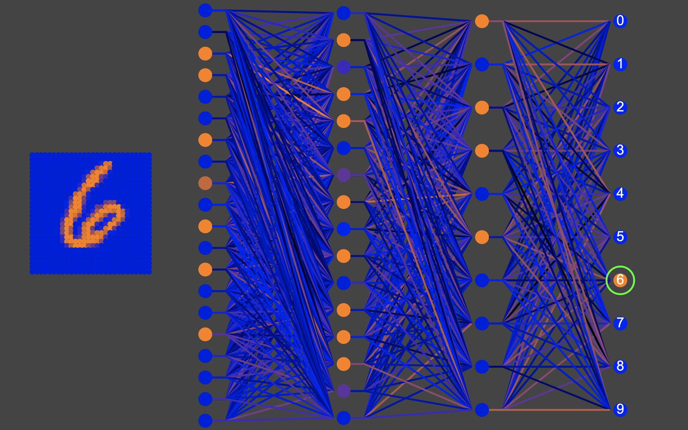

# Cold Porridge
Comparing ANNs and biophysical neuron modeling using the classic MNIST dataset

<blockquote>&ldquo;We are not interested in the fact that the brain has the consistency of cold porridge.&rdquo; 
  &emsp; &mdash; Alan Turing</blockquote>

To run, run the command `node node.js` in the directory of this repository and go to localhost:3000 in a web browser.

